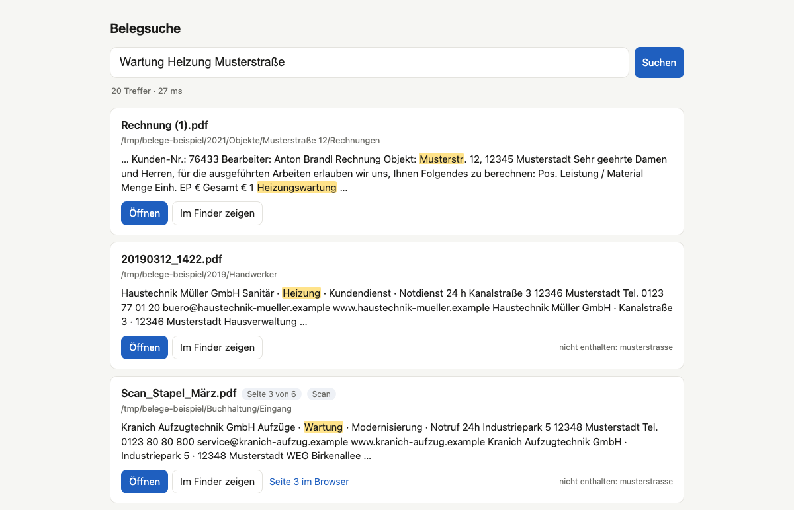

# Belegsuche

*In English:* Belegsuche is a local search tool for receipts, invoices and scanned documents on macOS.
It reads PDFs and images, recognizes text in scans with Apple's built-in Vision framework, and keeps the
search index on your Mac without changing the original files. The search is tuned for German documents
(amounts, invoice numbers, umlauts, street abbreviations, compound words, typos); the rest of this README is in German.

Belege, Rechnungen und Dokumente auf dem Mac durchsuchen – auch eingescannte, auch wenn die Datei
`Scan_00487.pdf` heißt und tief in einem Unterordner liegt.



*Beispiel mit dem erfundenen Testbestand aus `tools/make_testdata.py`.*

- **Lokal**: keine Cloud, keine laufenden Kosten. Texterkennung (OCR) mit Apples eingebautem Vision-Framework.
- **Originale bleiben unverändert**: Dateien werden nur gelesen. Der Suchindex liegt auf dem Mac
  (`~/Library/Application Support/Belegsuche/index.db`), nicht im durchsuchten Ordner.
- **Für deutsche Belege gebaut**: `1.234,56 €` = `1234,56` · `RE-2021/00487` = `2021-00487` = `RE 2021 00487` ·
  `Müller` = `Mueller` · `Musterstraße` = `Musterstr.` · `Heizung` findet `Heizungswartung` ·
  `Hausmeister` findet `Hauswart` · Tippfehler wie `Schornsteinfger` werden toleriert.
- **Treffer** mit Dateiname, Ordner, Seite und markiertem Textausschnitt; Öffnen oder im Finder zeigen per Klick.

## Installation

Voraussetzung: macOS 13 oder neuer, Python 3.10+. Das von macOS mitgelieferte `python3` (3.9) ist zu alt:
dann zuerst `brew install python@3.12` und im zweiten Befehl `python3.12 -m venv .venv` statt `python3 -m venv .venv`.

```bash
git clone https://github.com/alsharmani0/belegsuche.git && cd belegsuche
python3 -m venv .venv && .venv/bin/pip install -e .
```

## Benutzung

```bash
# 1. Ordner einlesen (einmalig; bei großen Beständen Stunden bis Tage – Abbruch mit Ctrl+C jederzeit möglich,
#    beim nächsten Aufruf geht es an derselben Stelle weiter)
.venv/bin/belegsuche index "/Volumes/SSD/Belege"

# 2. Suchen im Browser
.venv/bin/belegsuche start

# oder in der Kommandozeile
.venv/bin/belegsuche suche Wartung Heizung Musterstraße

# Was ist durchsuchbar, was nicht (Fehler, Scans ohne Text, nicht unterstützte Dateien)?
.venv/bin/belegsuche bericht --csv probleme.csv

# Später: nur neue/geänderte Dateien nachziehen
.venv/bin/belegsuche index

# Dateien mit Fehlern erneut versuchen (z. B. nachdem die SSD mitten im Lauf abgezogen wurde)
.venv/bin/belegsuche index --fehler-wiederholen
```

Die Texterkennung läuft parallel in mehreren Prozessen (Standard: Anzahl Kerne − 2, höchstens 8;
ändern mit `--parallel N`). Ein zweiter gleichzeitiger Einlese-Lauf wird abgelehnt.

**SSD abgezogen?** Die Suche funktioniert weiter, nur Öffnen geht erst nach dem Anschließen. Ein Einlese-Lauf
ohne SSD ändert nichts; wird die SSD mitten im Lauf abgezogen, hält das Einlesen an und macht beim nächsten Start
weiter. Hängt die SSD später unter einem anderen Namen (z. B. „SSD 1“), erkennt `belegsuche index "/Volumes/SSD 1/…"`
das automatisch; von Hand geht es mit `belegsuche ordner` (zeigt die IDs) und `belegsuche ordner umziehen 1 "/Volumes/Neu"`.

**Eigene Synonyme**: Datei `synonyme.txt` neben der Index-Datenbank, eine Gruppe pro Zeile:
`hausmeister, hauswart, objektbetreuer`.

## Suchqualität messen

Eine CSV-Datei mit Suchfragen und dem jeweils erwarteten Dokument anlegen (Semikolon; `datei` ist der Pfad relativ
zum eingelesenen Ordner, alternativ `<Ordnername>/<Pfad>` oder der vollständige Pfad – bei gleichem relativem Pfad
in mehreren eingelesenen Ordnern den vollständigen Pfad angeben):

```
suche;datei;seite;notiz
Wartung Heizung Musterstraße;2021/Objekte/Scan_00487.pdf;1;Beschreibung
RE-2021/00487;2021/Objekte/Scan_00487.pdf;1;Nummer
```

```bash
.venv/bin/belegsuche test meine_suchen.csv
```

Ausgabe: wie oft das Dokument auf Platz 1 / unter den ersten 5 / unter den ersten 20 steht und bei jedem
Fehlschlag die Ursache: *Text/Format* (Datei nicht lesbar), *OCR oder Wortwahl* (Begriff fehlt im erkannten Text
eines Scans – am Original prüfen, ob er dort steht), *Wortwahl* (Begriff steht nicht in der digitalen Textebene),
*Ranking* (gefunden, aber zu weit unten), *Index* (Datei nicht eingelesen oder Pfadangabe mehrdeutig).

Vergleich der Texterkennung: denselben Ordner zusätzlich mit Tesseract in eine eigene Datenbank einlesen
und dieselbe Liste testen:

```bash
.venv/bin/belegsuche --db /tmp/tess.db index "/Pfad/zum/Testordner" --ocr tesseract
.venv/bin/belegsuche --db /tmp/tess.db test meine_suchen.csv
```

## Unterstützte Dateien

PDF (mit Textebene oder gescannt), JPG, PNG, TIFF (mehrseitig), HEIC, BMP, GIF, WebP.
Andere Dateien (Word, Excel, E-Mails, ZIP) werden im Bericht als „nicht unterstützt“ gezählt.

## Entwicklung

```bash
.venv/bin/pip install -e ".[dev]"
.venv/bin/pytest
.venv/bin/python tools/make_testdata.py          # künstlicher Testbestand in testdata/
```

Lizenz: MIT
